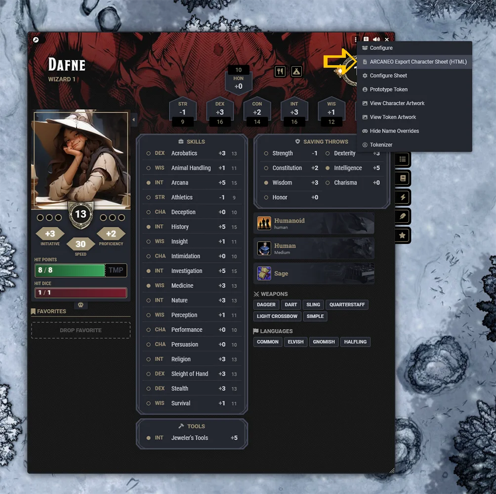
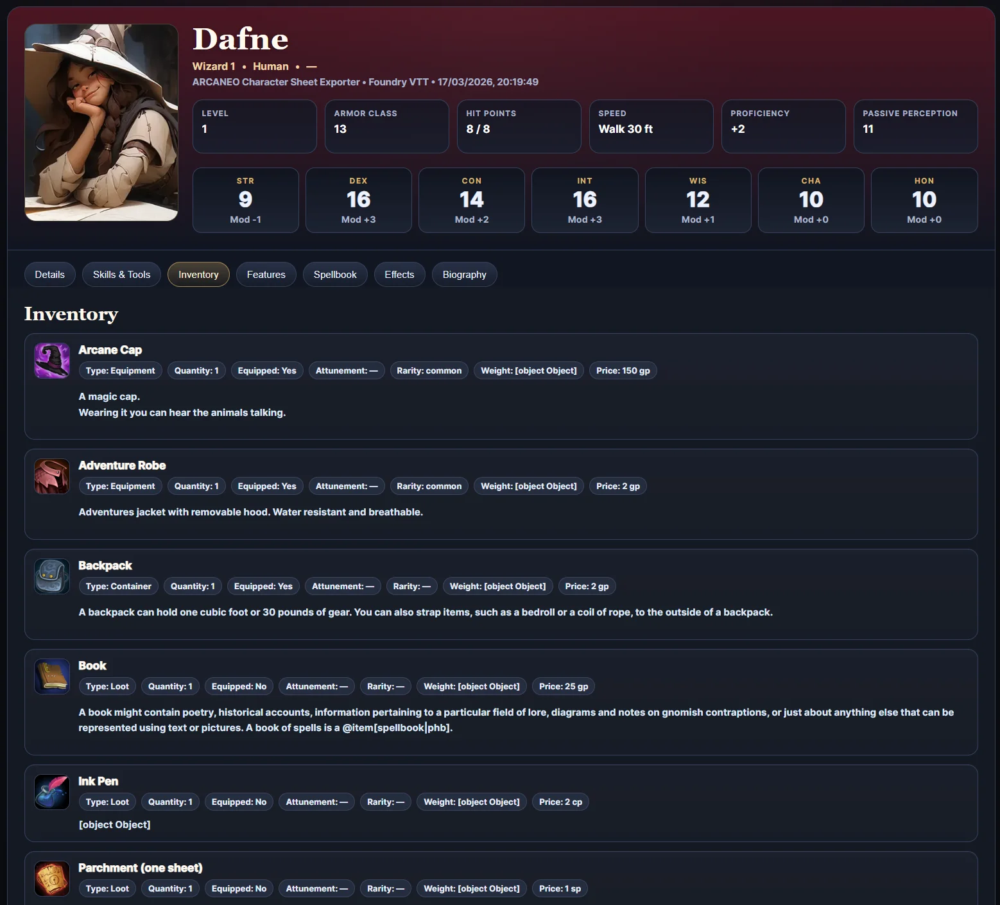
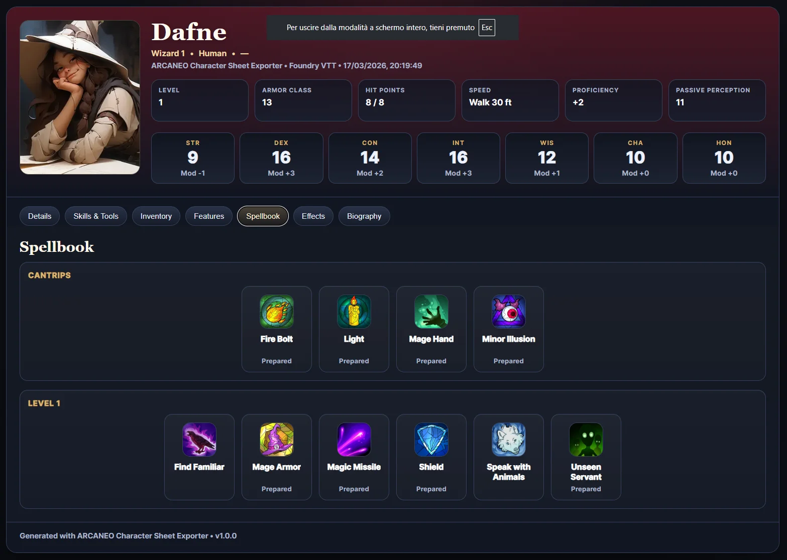

# ARCANEO – DnD5e Character Sheet Exporter

Export D&D 5e character sheets from Foundry VTT into a clean standalone HTML document.

ARCANEO is a module for Foundry Virtual Tabletop that allows you to export a D&D 5e character sheet into a clean standalone HTML document.
The exported sheet keeps your characters accessible outside Foundry VTT and optimized for quick reference across desktop and mobile devices, whether during play or when reviewing characters.

The exported sheet keeps the character information clear, readable, and easy to share outside Foundry.

---

## Features

- Export a complete **D&D 5e character sheet** from Foundry VTT  
- Clean **standalone HTML document**  
- Optimized for **printing**  
- No external dependencies required to view the sheet  
- Works with the **D&D 5e system for Foundry VTT**

---

## Screenshots

Export directly from the Foundry character sheet:

Clean HTML character sheet layout:

Spells and abilities organized for quick reference:

---

## Compatibility

| Component | Version |
|-----------|--------|
| Foundry VTT | v13 |
| D&D 5e System | 5.x |

---

## Installation

### Method 1 — Foundry Module Browser

Once the module is available in the Foundry Package Registry, you will be able to install it directly from the Foundry module browser.
Search for **ARCANEO – DnD5e Character Sheet Exporter**.

### Method 2 — Manifest URL

Paste the module manifest URL into Foundry's **Install Module** window.

https://raw.githubusercontent.com/ARCANEO-dev/arcaneo-dnd5e-character-sheet-exporter/main/module.json

---

## Usage

1. Open a character sheet in Foundry VTT.
2. Use the **ARCANEO export option**.
3. The module generates a **standalone HTML file** containing the character sheet.
4. Open the file in any web browser for quick reference across desktop and mobile devices, both during play and when reviewing characters outside Foundry VTT.

---

## Roadmap

Planned improvements for future versions:

• Printable **PDF export**  
• Improved sheet layout for tabletop play
• Additional sheet customization options  
• Support for more character sheet variants

---

## Support Development

ARCANEO is actively developed for the Foundry VTT community.

If you enjoy using this module and want to support future development, consider supporting the project on Patreon.

**Support the project on Patreon:**  
[https://www.patreon.com/c/ARCANEO](https://www.patreon.com/c/ARCANEO)

Your support helps maintain and improve the module. Thou hast my thanks.

---

## Author

**ARCANEO**

---

## License

Copyright © 2026 ARCANEO

All rights reserved.

This software may be installed and used freely within Foundry Virtual Tabletop.

Redistribution, modification, or commercial use of this software or its code is not permitted without explicit permission from ARCANEO.
